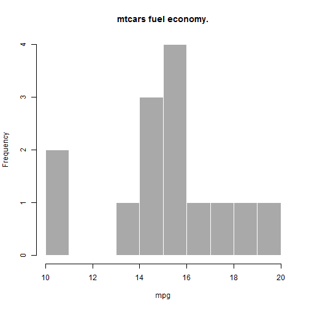

## Why you need my shiny app

Ever wondered how mpg varies between cars?
Want an easy to use app that plots for you?
look no further, this app is for you!!!

--- .class #id 

## My app is for you!

This app will plot a histogram of mtcars data based on user input.
Users select the number of histogram bins
and the number of engine cylinders they want to see data for

--- .class #id3

## Sample chart - 4 cylinder cars

 

--- .class #id4

## Sample chart - 8 cylinder cars

Users can view the information they want.
Alternatively this app can be modified 
to provide other user input options and different chart outputs.

 
